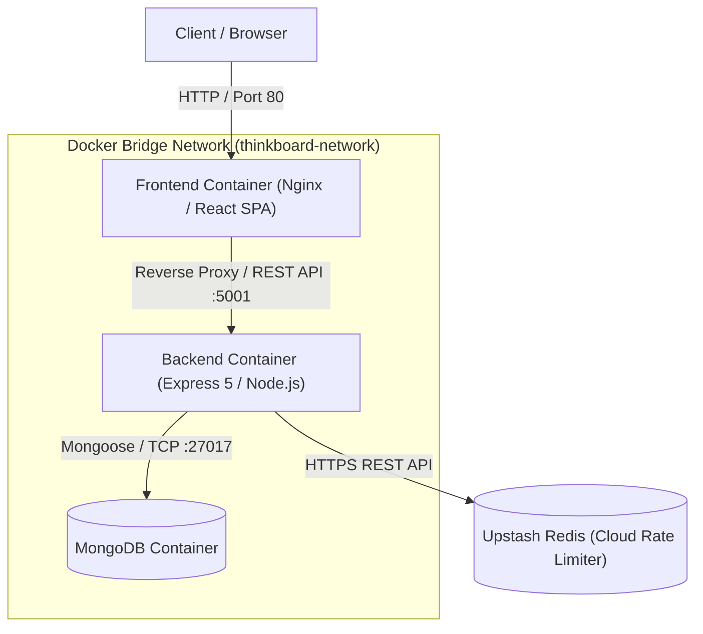
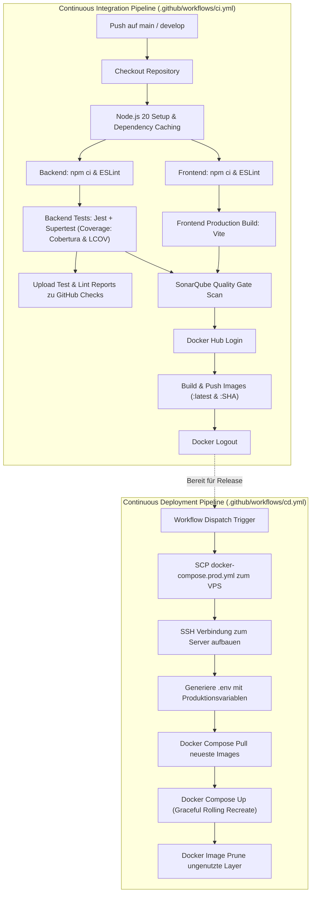

# Thinkboard — DevOps & Cloud Engineering Projekt

> **Fullstack MERN Notizverwaltungs-Anwendung mit integriertem DevOps-Lebenszyklus:** Automatisierte CI/CD-Pipelines, Multi-Stage Docker-Containerisierung, SonarQube Code-Qualitätsanalyse, Kubernetes Orchestrierung via Helm und automatisiertes VPS-Deployment.

---

## Inhaltsverzeichnis

- [1. Projektübersicht](#1-projektübersicht)
- [2. Systemarchitektur](#2-systemarchitektur)
- [3. CI/CD Pipeline Workflow](#3-cicd-pipeline-workflow)
- [4. Technologie-Stack & Toolauswahl](#4-technologie-stack--toolauswahl)
- [5. Implementierte DevOps-Praktiken](#5-implementierte-devops-praktiken)
- [6. Projektstruktur](#6-projektstruktur)
- [7. Lokale Inbetriebnahme](#7-lokale-inbetriebnahme)
- [8. Tests & Codequalität](#8-tests--codequalität)
- [9. Kubernetes Deployment via Helm](#9-kubernetes-deployment-via-helm)
- [10. GitHub Secrets & CI/CD Konfiguration](#10-github-secrets--cicd-konfiguration)

---

## 1. Projektübersicht

**Thinkboard** ist eine moderne Fullstack-Webanwendung zur strukturierten Verwaltung von Notizen. Der Schwerpunkt dieses Projekts liegt auf der **vollständigen Etablierung industrieller DevOps-Praktiken** über den gesamten Software-Entwicklungslebenszyklus (SDLC):

- **Automatisierte Qualitätskontrollen:** Linting, Unit- & Integrationstests, Code Coverage und statische Code-Analyse bei jedem Push.
- **Sichere und schlanke Containerisierung:** Multi-Stage Docker-Builds für minimale Angriffsflächen und geringe Image-Größen.
- **Continuous Integration (CI):** Paralleles Bauen, Testen und Veröffentlichen versionierter Multi-Architektur Docker-Images auf Docker Hub.
- **Continuous Deployment (CD):** Zero-Downtime Deployment auf einem VPS-Server via SSH und Docker Compose.
- **Cloud-Native Bereitstellung:** Vollständige Kubernetes-Manifeste als wiederverwendbares Helm Chart.

---

## 2. Systemarchitektur

Die Anwendung basiert auf einer containerisierten Multi-Tier-Architektur:



---

## 3. CI/CD Pipeline Workflow

Die kontinuierliche Integration und Bereitstellung wird über zwei GitHub Actions Workflows realisiert:



---

## 4. Technologie-Stack & Toolauswahl

### Anwendungsentwicklung

| Komponente        | Technologie               | Begründung                                                                                        |
| :---------------- | :------------------------ | :------------------------------------------------------------------------------------------------ |
| **Frontend**      | React 19 + Vite           | Schnelle Hot-Module-Replacement (HMR) Entwicklungszeiten und optimiertes Rollup/Vite-Bundling.    |
| **Styling & UI**  | Tailwind CSS + DaisyUI    | Deklaratives, wartbares CSS-Designsystem ohne Performance-Overhead.                               |
| **Backend**       | Node.js (ESM) + Express 5 | Asynchrones, leichtgewichtiges REST-API-Framework mit nativer ES-Modul-Unterstützung.             |
| **Datenbank**     | MongoDB + Mongoose        | Dokumentenorientierte NoSQL-Datenbank mit Schema-Validierung und einfacher Skalierbarkeit.        |
| **Rate Limiting** | Upstash Redis             | Serverless Redis-Lösung zur Ratenbegrenzung von API-Anfragen ohne lokalen Infrastruktur-Overhead. |

### DevOps & Infrastruktur

| Tool                 | Einsatzbereich           | Warum gewählt?                                                                                     |
| :------------------- | :----------------------- | :------------------------------------------------------------------------------------------------- |
| **GitHub Actions**   | CI/CD Automation         | Direkte Integration in das GitHub-Ökosystem ohne externen Serverbedarf.                            |
| **Docker & Compose** | Containerisierung        | Gewährleistet identische Umgebungen zwischen Entwicklung, CI-Runner und Produktion.                |
| **SonarQube**        | Code Quality & Security  | Automatische Erkennung von Code Smells, Sicherheitslücken und Überwachung der Testabdeckung.       |
| **Jest + Supertest** | Automated Testing        | Zuverlässiges Testen von HTTP-Endpunkten mit Mocking und LCOV/JUnit-Reporterzeugung.               |
| **Helm**             | Kubernetes Orchestration | Parametrisierte K8s-Manifeste für reproduzierbare Deployments über verschiedene Umgebungen hinweg. |

---

## 5. Implementierte DevOps-Praktiken

1. **Multi-Stage Docker Builds:**
   - **Frontend:** Build-Stage mit Node.js 20 (`vite build`) und schlanke Produktions-Stage mit `nginx:alpine` (Gesamtgröße ~35 MB).
   - **Backend:** Reduzierung auf Produktions-Dependencies (`npm ci --only=production`) auf Basis von `node:20-alpine`.

2. **GitHub Actions Dependency Caching:**
   - Caching von `~/.npm` basierend auf `package-lock.json` im Frontend und Backend. Reduziert die Pipeline-Laufzeit um über 60%.

3. **Automatisierte PR Check-Runs & Reporting:**
   - Integration von `jest-junit` mit `dorny/test-reporter` zur visuellen Darstellung von Testergebnissen direkt in GitHub.
   - Umwandlung von ESLint-Ergebnissen via `MeilCli/common-lint-reporter` in interaktive GitHub Check Annotations.

4. **Container Healthchecks:**
   - MongoDB: Integrierter `mongosh ping` Healthcheck.
   - Backend: `/api/health` Endpunkt mit `wget` Überwachung.
   - Automatisches Warten von abhängigen Containern (`condition: service_healthy`) in Docker Compose.

5. **Resilientes Rate Limiting mit Graceful Fallback:**
   - Globaler API-Schutz via Upstash Redis.
   - Bei fehlenden oder unerreichbaren Redis-Zugangsdaten schaltet das Backend lokal automatisch auf einen Bypass-Modus um, um die lokale Entwicklung nicht zu blockieren.

---

## 6. Projektstruktur

```plaintext
Devops_project/
├── .github/
│   └── workflows/
│       ├── ci.yml                 # Continuous Integration Pipeline
│       └── cd.yml                 # Continuous Deployment Pipeline
├── backend/
│   ├── src/
│   │   ├── config/                # DB-Verbindung (Mongoose)
│   │   ├── controllers/           # API Controller (CRUD für Notes)
│   │   ├── middleware/            # Rate Limiter Middleware
│   │   ├── models/                # Mongoose Datenmodelle
│   │   ├── routes/                # Express Route-Definitionen
│   │   ├── tests/                 # Unit- & Integrationstests (Jest)
│   │   ├── app.js                 # Express App Konfiguration
│   │   └── server.js              # Server Listener Einstiegspunkt
│   ├── .dockerignore
│   ├── .env.example               # Vorlage für Backend Umgebungsvariablen
│   ├── Dockerfile                 # Multi-Stage Node.js Dockerfile
│   ├── eslint.config.js           # Backend ESLint Konfiguration
│   └── package.json               # Backend Dependencies & Test Scripts
├── frontend/
│   ├── src/
│   │   ├── components/            # Wiederverwendbare React Komponenten
│   │   ├── pages/                 # Seiten (Home, Create, Detail)
│   │   ├── App.jsx                # Hauptanwendungskomponente
│   │   └── main.jsx               # React Einstiegspunkt
│   ├── .dockerignore
│   ├── Dockerfile                 # Multi-Stage Nginx/React Dockerfile
│   ├── nginx.conf                 # Nginx Webserver Konfiguration
│   ├── eslint.config.js           # Frontend ESLint Konfiguration
│   └── package.json               # Frontend Dependencies & Build Scripts
├── helm/
│   └── thinkboard/                # Kubernetes Helm Chart
│       ├── templates/             # Deployments, Services, Secrets
│       ├── Chart.yaml             # Helm Metadaten
│       └── values.yaml            # Konfigurationswerte für K8s
├── docker-compose.yml             # Lokale Multi-Container Umgebung
├── docker-compose.prod.yml        # Produktions-Deployment Konfiguration
├── sonar-project.properties       # SonarQube Scanner Konfiguration
├── presentation_notes.md          # Dokumentation der Projektphasen & Notizen
└── README.md                      # Hauptdokumentation
```

---

## 7. Lokale Inbetriebnahme

### Option A: Schnellstart mit Docker Compose (Empfohlen)

Voraussetzung: [Docker Desktop](https://www.docker.com/) ist installiert.

```bash
# 1. Repository klonen
git clone https://github.com/Flirnz/Devops_project.git
cd Devops_project

# 2. Container-Stack starten (MongoDB, Backend, Frontend)
docker compose up -d --build

# 3. Status überprüfen
docker compose ps
```

- **Frontend:** [http://localhost](http://localhost) (Port 80)
- **Backend API:** [http://localhost:5001/api/notes](http://localhost:5001/api/notes)
- **Health Check:** [http://localhost:5001/api/health](http://localhost:5001/api/health)

Zum Beenden des Stacks:

```bash
docker compose down -v
```

---

### Option B: Manueller lokaler Entwicklungsstart

Voraussetzung: Node.js 20+ und eine laufende MongoDB-Instanz.

#### 1. Backend starten:

```bash
cd backend
npm install
cp .env.example .env
npm run dev
```

#### 2. Frontend starten:

```bash
cd frontend
npm install
npm run dev
```

---

## 8. Tests & Codequalität

### Backend Tests & Coverage ausführen:

```bash
cd backend
npm test
```

_Die Testergebnisse werden als JUnit-XML (`test-report.xml`) und als LCOV-Coverage-Report unter `coverage/` abgelegt._

### Linter ausführen:

```bash
# Backend Linting
cd backend
npm run lint

# Frontend Linting
cd frontend
npm run lint
```

### Frontend Build testen:

```bash
cd frontend
npm run build
```

---

## 9. Kubernetes Deployment via Helm

Das Projekt beinhaltet ein voll funktionsfähiges Helm Chart für die Bereitstellung in Kubernetes-Clustern (z. B. Minikube oder K3s):

```bash
# 1. In das Helm-Verzeichnis wechseln
cd helm/thinkboard

# 2. Chart linten und validieren
helm lint .

# 3. Release im Cluster installieren
helm install thinkboard .

# 4. Pods und Services überprüfen
kubectl get pods
kubectl get svc
```

---

## 10. GitHub Secrets & CI/CD Konfiguration

Für den vollautomatischen Ablauf der CI/CD-Pipelines sind folgende Secrets im GitHub Repository konfiguriert (`Settings > Secrets and variables > Actions`):

| Secret Name                | Verwendungszweck                                            |
| :------------------------- | :---------------------------------------------------------- |
| `DOCKER_USERNAME`          | Benutzername für Docker Hub (Image Push & Registry Login)   |
| `DOCKER_PASSWORD`          | Docker Hub Personal Access Token (PAT)                      |
| `SONAR_TOKEN`              | Authentifizierungstoken für SonarQube Scanner               |
| `SONAR_HOST_URL`           | URL der SonarQube Instanz                                   |
| `SSH_HOST`                 | Host-Adresse / IP des Produktions-VPS-Servers               |
| `SSH_USER`                 | SSH-Benutzername für das Remote-Deployment                  |
| `SSH_KEY`                  | Privater SSH-Schlüssel zur Authentifizierung auf dem Server |
| `UPSTASH_REDIS_REST_URL`   | REST-Endpunkt für Upstash Redis Rate Limiting               |
| `UPSTASH_REDIS_REST_TOKEN` | Authentifizierungstoken für Upstash Redis                   |

---

## Autor

- **Projekt:** DevOps & Cloud Engineering Portfolio
- **Repository:** [github.com/Flirnz/Devops_project](https://github.com/Flirnz/Devops_project)
